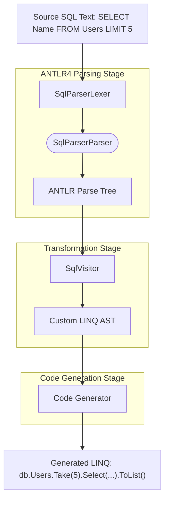

# Transpiler Processing Pipeline

Ez a dokumentum bemutatja az SQL -> LINQ transzpiler működési folyamatát a nyers SQL-től a futtatható C# kódig.

## Pipeline Diagram

```mermaid
flowchart TD
    Input[Source SQL Text: SELECT Name FROM Users LIMIT 5] --> Lexer[SqlParserLexer]

    subgraph ANTLR4 [ANTLR4 Parsing Stage]
        Lexer --> Parser([SqlParserParser])
        Parser --> AntlrTree[ANTLR Parse Tree]
    end

    subgraph Transform [Transformation Stage]
        AntlrTree --> Visitor[SqlVisitor]
        Visitor --> LinqAst[Custom LINQ AST]
    end

    subgraph CodeGen [Code Generation Stage]
        LinqAst --> CodeGenNode[Code Generator]
    end
    
    CodeGenNode --> Output["Generated LINQ: db.Users.Take#40;5#41;.Select#40;...#41;.ToList#40;#41;"]
```